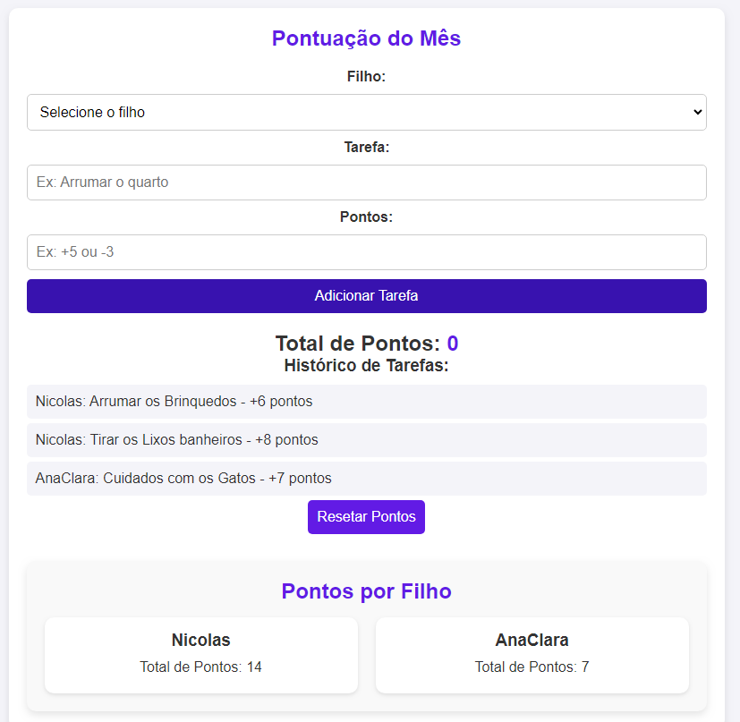

# Sistema de Pontuação para Tarefas Domésticas

Um sistema simples e moderno para gerenciar tarefas domésticas e atribuir pontos aos filhos de forma divertida e organizada. Desenvolvido com **HTML5**, **CSS3**, **JavaScript** e **PHP**.

---

# 🚀 Funcionalidades

- **Adicionar Tarefas**: Atribua tarefas aos filhos e defina pontos positivos ou negativos.
- **Pontos por Filho**: Visualize o total de pontos de cada filho de forma individual.
- **Histórico de Tarefas**: Mantenha um registro de todas as tarefas realizadas.
- **Resetar Pontos**: Reinicie os pontos e o histórico no início de cada mês.
- **Responsivo**: Funciona perfeitamente em dispositivos móveis, tablets e desktops.
<!-- - **Voltar ao Topo**: Botão flutuante para rolar a página de volta ao topo. -->

---

## 🛠️ Tecnologias Utilizadas

- **Frontend**:
  - HTML5
  - CSS3 (Flexbox, Grid, Media Queries)
  - JavaScript (Manipulação do DOM, localStorage)
- **Backend**:
  - PHP (Armazenamento de dados em arquivo `.txt`)
- **Ferramentas**:
  - Visual Studio Code (Editor de código)
  - Git (Controle de versão)

---

## 🙏 Agradecimentos
**Agradecer a Deus pelas habilidades adquiridas.**

**Agradecer a minha família por me apoiar.**

## 👨‍💻 Autor
Robson S. Ferreira
- [LinkedIn](https://www.linkedin.com/in/robson-ferreira-6539692b/)

- [GitHub](https://www.linkedin.com/in/robson-ferreira-6539692b/)

- [robsferreira@gmail.com](mailto:robsferreira@gmail.com)
---
